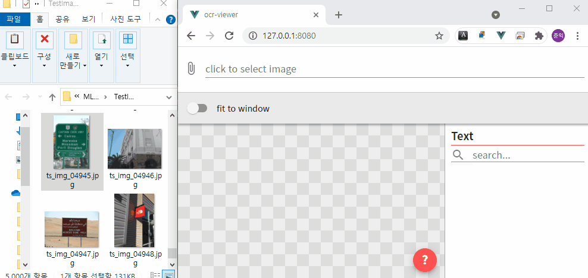

# ocr-viewer


<br />
Web application for easy and convenient viewing of OCR results.
<br />
You can easily open the image (drag and drop) and draw a text area on the image in real time (in the browser) so you can select and view only the text area you want.

### install
```
git clone https://github.com/whwnsdlr1/ocr-viewer
cd ocr-viewer
yarn install
yarn run serve
```
and access to http://localhost:port

### Demo (own OCR)
1. Implement your own recognizeImpl function in ocr-viewer> src> js> recognize.js. See the comment of the function.
2. Input the image in the web app(http://localhost:port)

### Demo (PaddleOCR)
1. Install python packages and Run websocket server
```
cd backend_example
pip install -r requirements_paddle_ocr.txt
python websocket_paddle_ocr.py
```
2. Input the image in the web app(http://localhost:port)

### Demo (EasyOCR)
1. Install pytorch
2. Install python packages and Run websocket server
```
cd backend_example
pip install -r requirements_easy_ocr.txt
python websocket_easy_ocr.py
```
3. Input the image in the web app(http://localhost:port)

### Control
- Image Input
    - Drag and drop
    - Using File dialog (top input element)
- Image Frame
    - left mouse & touch drag - panning
    - mouse wheel & pinch to zoom - zoom in / out
    - right mouse drag - adjust brightness and contrast
- Result Frame
    - You can search for the text you want. Only the searched text is displayed above the image.
    - Hover over the text badge to see the probability.
    - When you click a text badge, the clicked text is highlighted and displayed above the image.

### options
- Modify the code below to change the color.
```js
// ocr-viewer > src > components > Frame.vue
<script>
export default {
    ...
    data: function () {
        return {
            ...
            style: {
                boxColor: '#FFFF00',
                highlightBoxColor: '#FF0000'
            }
            ...
        }
    }
    ...
}
</script>
```
- Modify the code below to change the box line width.
```js
// ocr-viewer > src > plugins > cornerstoneToolsPlugin.js
export default {
  install: function (Vue) {
    ...
    cornerstoneTools.toolStyle.setToolWidth(2);
    ...
  }
}

```

## Browser support - (tested)
- Google Chrome 89+
- Mozilla FireFox 85+
